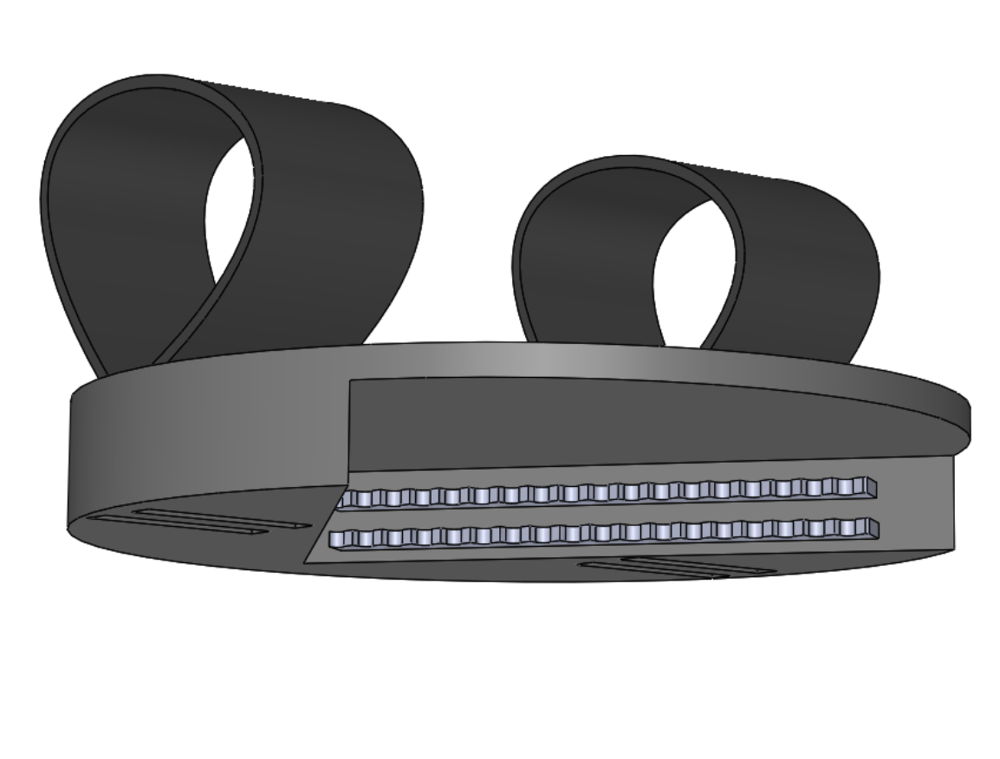
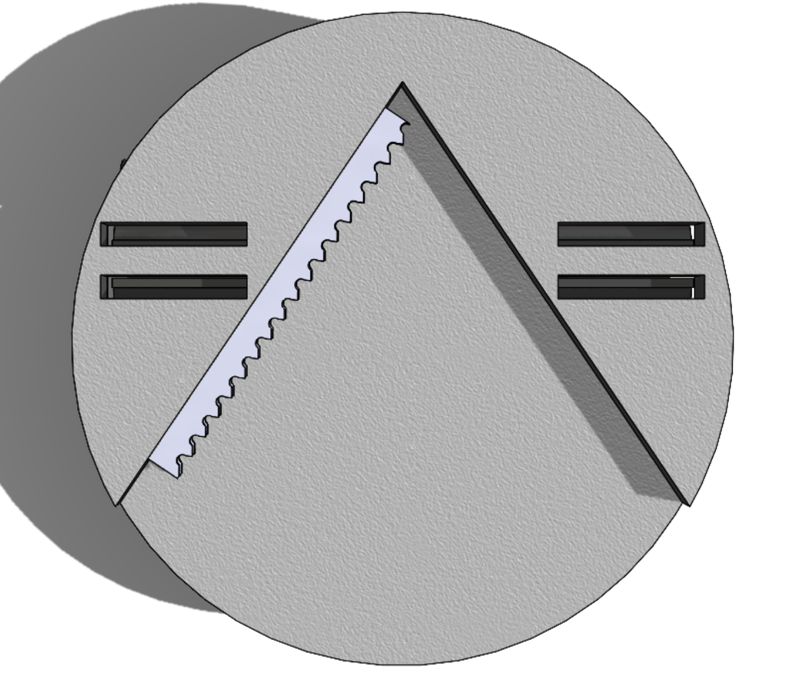

## MiCO: My Instant Container Opener

Every student in McCormick, the School of Engineering and Applied Science at Northwestern University, takes the class Design, Thinking and Communication. In this class, students are divided into teams of four and given ten weeks and $100 to solve a problem.

Our client was an 18-year-old male recovering from a gunshot wound, who has no active movement in either of his legs or his left arm. As a result, he has difficulty opening various containers. Our solution was a product named MiCO: the My Instant Container Opener that builds off an existing market product but is optimized for people in wheelchairs.

Today, our client uses this product frequently, and this class has provided me with a true sense of accomplishment and gratitude.

|     Side View      |       Top View       |
| :----------------: | :------------------: |
|  |  |

###### Please see the word document for my teams final report.
